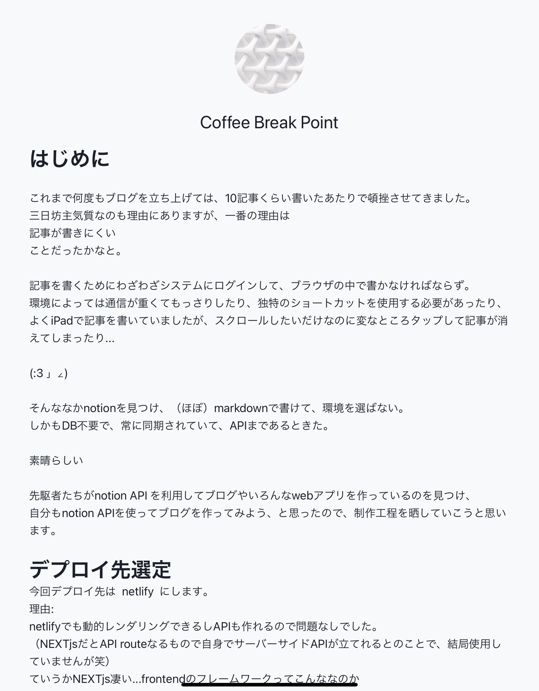

# notion API + NEXT.js + netlify でブログ立ち上げ ② notion api確認

Created: 2022年1月18日 19:09
Updated: 2022年12月12日 13:29
Published_Time: 2022年3月4日
Slug: build-blog-using-notion-api-2
Tags: Netlify, Nextjs, Notion, 個人開発
Published: Yes
URL: https://blog.shaba.dev/posts/build-blog-using-notion-api-2

## 初めに

[前回](https://blog.from-garage.com/posts/build-blog-using-notion-api-1)の続きです。
今回はNotion APIを利用する準備に取り掛かります。
APIで実行確認した後、Nextjsを利用するのでNotion SDKで利用できるようになるまでをゴールとします。

## API準備

### integration を作成

Notion APIを利用するためには、integrationというものを設定する必要があります。

利用する用途ごとにintegrationを作成し、Notionのdatabaseにintegrationからアクセスすることを許可することでAPIを利用することができるようになります。

integrationの作成は下記ページから。
流れに沿っていけば、すぐ作成できると思います。

[Notion - The all-in-one workspace for your notes, tasks, wikis, and databases.](https://www.notion.so/my-integrations)

<aside>
💡 privateかpublicかどちらで利用するか設定する箇所があるので、間違えないようにしましょう

</aside>

APIを使って記事の一覧を取得するためには、databaseに記事を入れておく必要があります。


ブログ記事を格納したdatabase

よくNotion API でブログ化されている方は、databaseにtableを使用されることが多いのですが、
個人的に凄い管理しにくい...ズラッと並んでくれてたほうがわかりやすくね？
ってことで、`list`を採用しています。
どちらでも問題ないと思いますが、APIで返ってくる型が変わるかどうかは未検証です。

databaseを作成したら画面右上の`Share`から、作成した`integration`を指定して共有しましょう。

## API実行

準備ができたので、とりあえずAPIを実行してみます。
Headは下記共通のよう。

```jsx
Authorization: Bearer  secret__xxxxx
Notion-Version: 2021-05-13
```

なお、レスポンス結果はめちゃくちゃ長いので割愛。

### database内一覧取得

```jsx
POST [https://api.notion.com/v1/databases/](https://api.notion.com/v1/databases/44aabc65af1740d695ffaa136252a016/query){database_id}[/query](https://api.notion.com/v1/databases/44aabc65af1740d695ffaa136252a016/query)
{
	"sorts": [
		{
			"timestamp": "last_edited_time",
			"direction":"ascending"
		}
	]
}
```

### ページ情報取得

```jsx
GET [https://api.notion.com/v1/pages/](https://api.notion.com/v1/pages/0cc5fc5b2ca1420fa242781160d16bc3){block_id}
```

ページもブロックの一つと捉えるらしいので、`block_id`にはpageのidを入れます。

## 子ブロック一覧取得

```jsx
GET [https://api.notion.com/v1/blocks/](https://api.notion.com/v1/blocks/e5aba4f5e3c441bb9f4841157b2f5482/children){block_id}[/children](https://api.notion.com/v1/blocks/e5aba4f5e3c441bb9f4841157b2f5482/children)
```

ページもブロックの一つと捉えるらしいので、`block_id`にはpageのidを入れます。

## Notion SDK

...と、ここまでAPIを実際に叩いて確認してきましたが、javascript / typescript に関しては、Notionがsdkを用意してくれています。

[GitHub - makenotion/notion-sdk-js: Official Notion JavaScript Client](https://github.com/makenotion/notion-sdk-js)

今回はNextjsで利用するので、ありがたくこのsdkを利用することにします。

```bash
yarn add @notionhq/client
```

### 使用してみる

Notion用のヘルパクラスを作ります。

```tsx
import { Client } from "@notionhq/client"
import type {
  QueryDatabaseResponse,
  ListBlockChildrenResponse,
} from '@notionhq/client/build/src/api-endpoints.d'

export default class Notion {
  private _notion: Client;
  private _token: string;
  private _databaseId: string;

  constructor(token: string, databaseId: string) {
    this._token = token;
    this._databaseId = databaseId;

    this._notion = new Client({
      auth: this._token
    });
  }

  public async getPostList() {
    const response: QueryDatabaseResponse = await this._notion.databases.query({
      database_id: this._databaseId,
      filter: {
        and: [{
          property: 'Published',
          checkbox: { equals: true }
        }],
      },
      sorts: [
        {
            "timestamp": "created_time",
            "direction":"descending"
        }
      ]
    });
    return postList;
  }

  public async getPostBlockListById(id: string) {
    const response: ListBlockChildrenResponse = await this._notion.blocks.children.list({
      block_id: id
    });
    return response;
  }
}
```

とりあえず記事一覧と記事内子ブロック一覧の取得メソッドを作成。

一旦ガワだけ。
詳細は記事ページ作り込むときにでも。

## 仮の画面作成

とりあえず一覧画面と記事画面




作り込みは後日